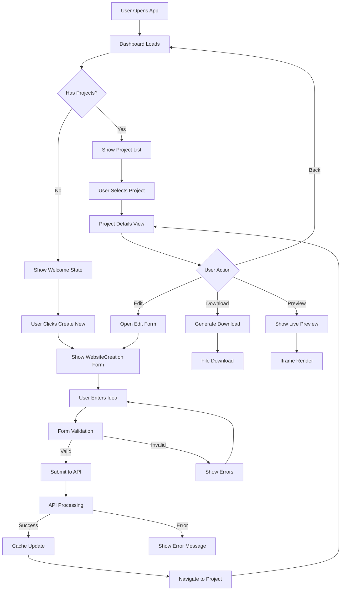

# AI Website Studio - Frontend Architecture & Structure

## 📋 Table of Contents

1. [Project Overview](#project-overview)
2. [Technology Stack](#technology-stack)
3. [Project Structure](#project-structure)
4. [Step-by-Step Development Process](#step-by-step-development-process)
5. [Architecture Patterns](#architecture-patterns)
6. [Component Design System](#component-design-system)
7. [Data Flow & State Management](#data-flow--state-management)
8. [API Integration](#api-integration)
9. [Workflow Diagram](#workflow-diagram)
10. [Development Guidelines](#development-guidelines)
11. [Performance Optimizations](#performance-optimizations)

---

## 🎯 Project Overview

**AI Website Creation** is a modern React-based web application that leverages AI to generate professional landing pages. Users can input their website ideas, and the system generates complete HTML/CSS code with modern design patterns.

### Key Features

- AI-powered website generation
- Real-time preview capabilities
- Code export functionality
- Responsive design system
- Professional UI/UX

---

## 🛠 Technology Stack

### Core Framework

- **Next.js 15.4.1** - React framework with App Router
- **React 19.1.0** - UI library with latest features
- **TypeScript 5.x** - Type safety and developer experience

### Styling & UI

- **Tailwind CSS 4.x** - Utility-first CSS framework
- **Shadcn/UI** - High-quality component library
- **Radix UI** - Headless UI primitives
- **Lucide React** - Beautiful icon library
- **Framer Motion** - Animation library

### State Management & Data Fetching

- **TanStack Query (React Query)** - Server state management
- **React Hook Form** - Form state management
- **Zod** - Schema validation

### HTTP Client

- **Axios** - Promise-based HTTP client

### Development Tools

- **ESLint** - Code linting
- **PostCSS** - CSS processing
- **Turbopack** - Fast bundler (dev mode)

---

## 📁 Project Structure

```
front-end/
├── 📁 public/                    # Static assets
│   ├── file.svg
│   ├── globe.svg
│   ├── next.svg
│   ├── vercel.svg
│   └── window.svg
├── 📁 src/
│   ├── 📁 app/                   # App Router (Next.js 13+)
│   │   ├── favicon.ico
│   │   ├── globals.css           # Global styles + Tailwind
│   │   ├── layout.tsx           # Root layout component
│   │   ├── page.tsx             # Home page component
│   │   └── providers.tsx        # Context providers
│   ├── 📁 components/           # Reusable components
│   │   ├── 📁 dashboard/        # Dashboard-specific components
│   │   │   ├── DashboardOverview.tsx
│   │   │   └── features-section.tsx
│   │   ├── 📁 demo/             # Demo/preview components
│   │   │   └── ProjectDetails.tsx
│   │   ├── 📁 form/             # Form components
│   │   │   ├── ideas-section.tsx
│   │   │   └── WebsiteIdeaForm.tsx
│   │   ├── 📁 layout/           # Layout components
│   │   │   ├── AppHeader.tsx
│   │   │   └── AppSidebar.tsx
│   │   ├── 📁 project/          # Project-specific components
│   │   │   └── ProjectDetails.tsx
│   │   ├── 📁 ui/               # Shadcn/UI components
│   │   │   ├── accordion.tsx
│   │   │   ├── button.tsx
│   │   │   ├── card.tsx
│   │   │   └── ... (40+ components)
│   │   └── WebsiteIdeaForm.tsx  # Legacy form component
│   ├── 📁 data/                 # Static data and configurations
│   │   └── data.ts              # Example ideas and features
│   ├── 📁 hooks/                # Custom React hooks
│   │   ├── use-mobile.ts        # Mobile detection hook
│   │   └── useWebsiteIdeas.ts   # API query hooks
│   ├── 📁 lib/                  # Utility libraries
│   │   ├── api.ts               # API client and types
│   │   └── utils.ts             # Common utilities
│   └── 📁 validations/          # Schema validations
│       └── form.ts              # Form validation schemas
├── 📄 .env.local                # Environment variables
├── 📄 .gitignore               # Git ignore rules
├── 📄 components.json          # Shadcn/UI configuration
├── 📄 eslint.config.mjs        # ESLint configuration
├── 📄 next.config.ts           # Next.js configuration
├── 📄 next-env.d.ts            # Next.js type definitions
├── 📄 package.json             # Dependencies and scripts
├── 📄 postcss.config.mjs       # PostCSS configuration
├── 📄 README.md                # Project documentation
└── 📄 tsconfig.json            # TypeScript configuration
```

---

## 🔨 Step-by-Step Development Process

### Phase 1: Project Initialization

#### Step 1: Create Next.js Project

```bash
npx create-next-app@latest front-end --typescript --tailwind --eslint --app --src-dir
cd front-end
```

#### Step 2: Install Core Dependencies

```bash
# UI Framework
npm install @radix-ui/react-slot @radix-ui/react-tooltip
npm install class-variance-authority clsx tailwind-merge
npm install lucide-react

# State Management
npm install @tanstack/react-query
npm install react-hook-form @hookform/resolvers zod

# HTTP Client
npm install axios

# Animation
npm install framer-motion
```

#### Step 3: Setup Shadcn/UI

```bash
npx shadcn@latest init
npx shadcn@latest add button card input textarea label separator
npx shadcn@latest add sidebar badge accordion alert dialog
```

### Phase 2: Project Configuration

#### Step 4: Configure Environment Variables

```bash
# .env.local
NEXT_PUBLIC_API_URL=http://localhost:3001
```

### Phase 3: Core Architecture Setup

#### Step 5: Create Provider Structure

#### Step 6: Setup Root Layout

### Phase 4: API Layer Development

#### Step 7: Create API Client

```typescript
// src/lib/api.ts
```

#### Step 8: Create Custom Hooks

```typescript
// src/hooks/useWebsiteIdeas.ts
```

### Phase 5: Component Development

#### Step 9: Create Form Validation

```typescript
// src/validations/form.ts
```

#### Step 10: Build Core Components

**WebsiteCreationForm Component:**

```typescript
// src/components/form/WebsiteCreationForm.tsx
```

**Dashboard Components:**

```typescript
// src/components/dashboard/Dashboard.tsx
```

#### Step 11: Create Layout Components

**App Sidebar:**

```typescript
// src/components/layout/AppSidebar.tsx
```

### Phase 6: Main Application Integration

#### Step 12: Create Main Page Component

```typescript
// src/app/page.tsx
```

---

## 🏗 Architecture Patterns

### 1. **Component Architecture**

- **Atomic Design Principles**: Components are organized from atoms (buttons) to organisms (dashboard)
- **Composition Pattern**: Components are composed together rather than inherited
- **Props Interface**: Strong TypeScript interfaces for all component props

### 2. **State Management Strategy**

```
┌─────────────────┐    ┌──────────────────┐    ┌─────────────────┐
│   Client State  │    │   Server State   │    │   Form State    │
│                 │    │                  │    │                 │
│ • UI State      │    │ • API Data       │    │ • Form Values   │
│ • Modal State   │    │ • Cache          │    │ • Validation    │
│ • View State    │    │ • Background     │    │ • Errors        │
│                 │    │   Sync           │    │                 │
└─────────────────┘    └──────────────────┘    └─────────────────┘
         │                        │                        │
         │                        │                        │
         ▼                        ▼                        ▼
┌─────────────────┐    ┌──────────────────┐    ┌─────────────────┐
│   useState()    │    │ TanStack Query   │    │ React Hook Form │
│   useReducer()  │    │                  │    │                 │
└─────────────────┘    └──────────────────┘    └─────────────────┘
```

### 3. **Data Flow Pattern**

```
User Action → Form Submit → API Call → Cache Update → UI Re-render
     ↓              ↓            ↓           ↓            ↓
  onClick      handleSubmit   axios.post  queryClient   useQuery
```

### 4. **Folder Organization Strategy**

```
Feature-Based Organization:
├── components/
│   ├── ui/           # Shared UI components (atoms)
│   ├── form/         # Form-related components
│   ├── dashboard/    # Dashboard feature
│   ├── layout/       # Layout components
│   └── project/      # Project feature
├── hooks/            # Custom hooks (business logic)
├── lib/              # Utilities and configurations
└── validations/      # Schema validations
```

---

## 🎨 Component Design System

### UI Component Hierarchy

```
┌─────────────────────────────────────────┐
│                Layout                   │
│  ┌─────────────┐  ┌─────────────────────┤
│  │   Sidebar   │  │       Content       │
│  │             │  │  ┌─────────────────┐│
│  │ • Navigation│  │  │     Header      ││
│  │ • Projects  │  │  └─────────────────┘│
│  │ • Tools     │  │  ┌─────────────────┐│
│  │             │  │  │      Main       ││
│  │             │  │  │                 ││
│  │             │  │  │ • Dashboard     ││
│  │             │  │  │ • Form          ││
│  │             │  │  │ • Project View  ││
│  │             │  │  └─────────────────┘│
│  └─────────────┘  └─────────────────────┤
└─────────────────────────────────────────┘
```

### Component Dependencies

```
App (page.tsx)
├── Providers
├── SidebarProvider
├── AppSidebar
│   ├── Sidebar (shadcn)
│   ├── Button (shadcn)
│   └── Badge (shadcn)
├── SidebarInset
├── AppHeader
│   ├── Breadcrumb (shadcn)
│   ├── Input (shadcn)
│   └── DropdownMenu (shadcn)
└── Main Content
    ├── DashboardOverview
    │   ├── Card (shadcn)
    │   ├── Button (shadcn)
    │   └── FeaturesSection
    ├── WebsiteIdeaForm
    │   ├── Card (shadcn)
    │   ├── Textarea (shadcn)
    │   ├── Button (shadcn)
    │   └── IdeasSection
    └── ProjectDetails
        ├── Card (shadcn)
        ├── Badge (shadcn)
        └── Separator (shadcn)
```

---

## 🔄 Data Flow & State Management

### State Management Overview

```
┌─────────────────────────────────────────────────────────┐
│                    Application State                    │
├─────────────────────────────────────────────────────────┤
│                                                         │
│  ┌─────────────┐  ┌──────────────┐  ┌─────────────────┐  │
│  │   Local     │  │    Server    │  │      Form       │  │
│  │   State     │  │    State     │  │     State       │  │
│  │             │  │              │  │                 │  │
│  │ • View Mode │  │ • Website    │  │ • Input Values  │  │
│  │ • Selected  │  │   Ideas      │  │ • Validation    │  │
│  │   Idea      │  │ • Loading    │  │ • Errors        │  │
│  │ • Show Form │  │ • Error      │  │ • Touched       │  │
│  │             │  │              │  │                 │  │
│  └─────────────┘  └──────────────┘  └─────────────────┘  │
│                                                         │
└─────────────────────────────────────────────────────────┘
```

---

## 🌐 API Integration

### HTTP Client Configuration

```typescript
// src/lib/api.ts
export const api = axios.create({
  baseURL: process.env.NEXT_PUBLIC_API_URL,
  headers: {
    'Content-Type': 'application/json',
  },
  timeout: 10000,
});

// Request interceptor
api.interceptors.request.use((config) => {
  // Add auth headers, logging, etc.
  return config;
});

// Response interceptor
api.interceptors.response.use(
  (response) => response,
  (error) => {
    // Global error handling
    return Promise.reject(error);
  }
);
```

### API Layer Architecture

```
┌─────────────────┐    ┌─────────────────┐    ┌─────────────────┐
│   Components    │    │     Hooks       │    │   API Layer     │
│                 │    │                 │    │                 │
│ • Form Submit   │───▶│ • useQuery      │───▶│ • HTTP Client   │
│ • Button Click  │    │ • useMutation   │    │ • Type Safety   │
│ • Data Display  │◀───│ • Cache Mgmt    │◀───│ • Error Handle  │
│                 │    │                 │    │                 │
└─────────────────┘    └─────────────────┘    └─────────────────┘
```

### Type Safety Strategy

```typescript
// API response types
export interface ApiResponse<T> {
  success: boolean;
  data?: T;
  message: string;
  statusCode?: number;
}

// Domain models
export interface WebsiteIdea {
  _id: string;
  idea: string;
  userId?: string;
  sections: WebsiteSection[];
  status: string;
  createdAt: string;
  updatedAt: string;
}

// API methods with full type safety
export const websiteIdeaApi = {
  create: async (idea: string): Promise<ApiResponse<WebsiteIdea>> => {
    const response = await api.post<ApiResponse<WebsiteIdea>>(
      '/api/website-ideas',
      { idea }
    );
    return response.data;
  },
  // ... other methods
};
```

---

## 📊 Workflow Diagram

### User Journey Flow



---

## 📝 Changelog & Versioning

### Version 1.0.0 (Current Release)

_Release Date: July 2025_

- ✅ AI-Powered Website Generation: Complete landing page creation from user ideas
- ✅ Professional UI/UX: Shadcn/UI components with Tailwind CSS 4.x
- ✅ Real-time Preview: Live website preview with device responsiveness
- ✅ Code Export: Download complete HTML/CSS files
- ✅ Responsive Design: Mobile-first approach with tablet and desktop optimization
- ✅ Professional User Interface

### Planned Features (v2.0.0)

- 🔄 Enhanced AI Capabilities (More Multi-Section Generation)
- 🔄 Enhanced User Management (Add User Authentication)
- 🔄 Advanced Design Features (Add Custome Themes)
- 🔄 Enhanced Development Tools (Add Code Editor, Live Editing)
- 🔄 Add Usage Analytics (Track user interactions and popular features)
- 🔄 Add Deployment Option to generated websites (One-Click Deployment to vercel)
- 🔄 Add Delete and Update features in UI
- 🔄 Add Multi-language

---

### 🐛 Known Issues & Limitations (v1.0.0)

#### Current Limitations

1. **Single User**: No multi-user support or authentication
2. **Local Storage**: Projects stored locally, no cloud sync
3. **Limited Templates**: Single design template per generation
4. **Basic Preview**: Limited device simulation capabilities
5. **No Versioning**: Cannot track project changes over time

#### Planned Fixes

- Multi-user authentication system (v2.0.0)
- Cloud storage and synchronization (v2.0.0)
- Template variety and customization (v2.0.0)
- Enhanced preview with multiple device types (v1.1.0)
- Project history and version control (v2.0.0)
